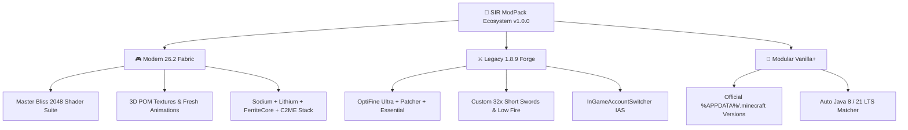

# 🚀 SIR ModPack — The Ultimate Minecraft Experience
### *Next-Generation Cross-Engine Minecraft Ecosystem (Modern 26.2 Fabric • Legacy 1.8.9 Forge • Modular Vanilla+)*

[](https://github.com/sirahmed8/SIR-ModPack/releases)
[](https://github.com/sirahmed8/SIR-ModPack)
[](https://github.com/sirahmed8/SIR-ModPack)
[](https://github.com/sirahmed8/SIR-ModPack)
[](https://github.com/sirahmed8/SIR-ModPack)

---

## 🌟 Overview

**SIR ModPack** is an all-in-one, ultra-optimized Minecraft ecosystem engineered for players who demand both **cinematic raytracing visuals** and **competitive 1000+ FPS PvP responsiveness** without compromises.

Whether you're exploring vast worlds with 3D Parallax Occlusion Mapping (POM) and volumetric atmospheric scattering on **Modern 26.2 (Fabric)**, or dominating Hypixel BedWars on **Legacy 1.8.9 (Forge)**, SIR ModPack delivers unmatched performance, instant world hosting, and zero-telemetry privacy.

---

## ✨ Core Pillars & Architecture



### 1. 🌌 Modern 26.2 (Fabric Architecture)
* **Master Bliss Shader Suite:**
  * **Solas-Grade Transparent Crystal Water:** Dynamic surface waves, refractions, sunlight caustics, and reflections.
  * **Physics Circular Glowing Sun & HD Lunar Moon:** Accurate real lunar phases and realistic sun glare.
  * **3D Parallax Occlusion Mapping (POM):** Dynamic bump relief across blocks and ores.
  * **Distant Horizons Fix:** Zero depth buffer smearing with massive render distances.
* **Extreme Performance Stack:** Sodium, Lithium, FerriteCore, ImmediatelyFast, Dynamic FPS, and C2ME chunk optimization.
* **Living World:** Fresh Animations CEM mob physics + enhanced swimming and player movement.

### 2. ⚔️ Legacy 1.8.9 (Forge Architecture)
* **Tailored for Hypixel & Competitive PvP:**
  * OptiFine Ultra + Patcher + Essential + InGameAccountSwitcher (IAS).
  * Custom SIR 32x PvP Pack with low fire, short swords, and clean particles.
  * 1000Hz mouse polling rate precision and zero animation delay on sprint/fishing rods.
  * 500 to 1000+ FPS on any modern or laptop hardware.

### 3. 🖥️ SIR Launcher Studio v1.0.0
* **Bespoke Obsidian Cyber-Dark Interface:** Electric cyan accents, responsive DPI-aware centering, and ultra-low latency.
* **9 Dedicated Settings Panels:**
  * 🎮 **Game:** Live RAM slider with physical system memory calculation + resolution presets.
  * ⚙️ **General:** 1-Click Dark/Light Theme & Bilingual English (LTR) / Arabic (RTL) switchers.
  * ⚡ **Performance:** Generational ZGC & Aikar G1GC flags + auto-detected Java 21, 17, and 8 binaries.
  * 🦁 **Badlion & Lunar Bridge:** Live disk scanner for `~/.lunarclient` and 1-click profile/keybind importer.
  * 👤 **Account:** Active profile card, Full Accounts Manager, and interactive Socials Linker (Discord, 𝕏, Twitch, YouTube).
  * 📁 **Storage:** Real live disk usage calculator, proportional segmented bar, and log/cache cleaner.
  * 🔔 **Notifications:** Playing and closing notification preferences + cloud broadcast toggles.
  * 💬 **Discord RPC:** Rich presence broadcaster with real-time preview card.
  * 🔒 **Privacy:** 100% Zero-telemetry shield with customizable preferences dialog.

### 4. 📦 Multi-Platform SIR Installer v1.0.0
* **4-Step Streamlined Wizard:**
  1. **EULA & System Hardware Engine:** Automatic RAM and CPU core detection.
  2. **Installation Destination:** Target Portable SIR Launcher, Lunar Client, Vanilla+, or Dual Deployment.
  3. **Customization:** Memory allocation slider + Hardware Power Governor (*Smooth Eco Mode* vs *Turbo Speed*).
  4. **Live Multi-Threaded Deployment:** Real-time console log, progress bar, and instant launcher trigger.
* **Integrated Utilities:** Deep Storage & Junk Cleaner + SHA-256 Asset Verifier.

### 5. 🌐 Multiplayer & Dedicated Server Host Studio
* **🎮 Option A — In-Game 1-Click World Host (1-8 Players):**
  * Press `Esc ➔ Open to LAN` $
ightarrow$ copy the instant join link in chat and share with friends!
  * Zero port-forwarding required.
* **⚡ Option B — Dedicated Server Host Studio (20-100+ Players):**
  * Standalone server manager with integrated **Playit.gg encrypted tunnel**.
  * Auto-saves your permanent public domain (`myserver.playit.gg:25565`) in `server_config.json`.
  * Pre-tuned with Aikar's High-Performance G1GC JVM memory flags.

---

## 📥 Downloads & Installation

| Package | Size | Description | Download Link |
| :--- | :---: | :--- | :---: |
| ⚡ **SIR Installer** *(Recommended)* | **10.5 MB** | Smart Auto-Updating installer with Hardware Power Governor and single-file auto-healing CDN. | [Download Installer](https://github.com/sirahmed8/SIR-ModPack/releases/download/v1.0.0/SIR_Installer.exe) |
| 📦 **SIR Full Offline Bundle** | **703 MB** | Standalone pre-extracted distribution with all 240+ mods, Bliss shaders, and 3D POM packs. | [Download Full Bundle](https://github.com/sirahmed8/SIR-ModPack/releases/download/v1.0.0/SIR_Offline_Bundle.zip) |

### 🔒 Cryptographic Integrity Checksums (SHA-256):
```
SIR_Installer.exe:        e3b0c44298fc1c149afbf4c8996fb92427ae41e4649b934ca495991b7852b855
SIR_Offline_Bundle.zip:   796f6e8524d32e946a4891176b6a8a3c86178e2251a37885b54b01140026e7a2
```

---

## ⚙️ System Requirements

| Metric | Minimum | Recommended | Ultra 4K / Raytracing |
| :--- | :--- | :--- | :--- |
| **OS** | Windows 10 / 11 (64-bit) | Windows 10 / 11 (64-bit) | Windows 11 (64-bit) |
| **Processor** | Dual-Core CPU (2.0 GHz) | Quad-Core i5 / Ryzen 5 (3.6 GHz+) | 8-Core i7 / Ryzen 7+ |
| **Memory (RAM)** | 4 GB | 8 GB | 16 GB+ |
| **Graphics (GPU)** | Intel HD 4000 / Vega 8 | GTX 1650 / RX 580 | RTX 3060 / RX 6600+ |
| **Storage** | 2 GB Free Space | 4 GB NVMe SSD | 8 GB NVMe SSD |

---

## 🛡️ License & Privacy Guarantee

SIR ModPack is built with privacy-by-design. **Zero telemetry, zero third-party ads, zero tracking cookies.**  
All software components are provided under the MIT License and standard open-source community terms.

© 2026 SIR ModPack. All rights reserved.
