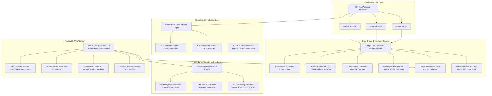

# 🏗️ SIR ModPack — Comprehensive Architectural Blueprint & Engineering Specification
### *Unified Minecraft Experience • Semantic Versioning v1.0.0 • August 2026*

---

## 🧭 1. System Architecture Overview

The **SIR ModPack Ecosystem** is an enterprise-grade, high-performance Minecraft platform consisting of one native dispatcher executable with three internal desktop modes, a full Next.js 16 web platform, a GLSL shader compilation engine, 3D Parallax Occlusion Mapping (POM) resource packs, and a zero-telemetry hardware diagnostic bridge.

---

## 💻 2. Client Application Layer

### 1. Dispatcher and Launcher mode
- **Technology:** Python 3.14 + `pywebview` 6.2 + Tailwind CSS + Lucide Icons + Spring Physics.
- **Key Modules:**
  - **Launchpad View:** 1-Click launch for Modern 26.2 (Fabric 1.21.4) and Legacy 1.8.9 (Forge/Paper PvP).
  - **Server Radar:** Live monitoring of 100+ public and custom multiplayer nodes with 3-state cycling toggle (`Fastest Ping` ➔ `Most Players` ➔ `Default Order`), ping telemetry, and 1-click join.
  - **3D Skin Studio & Capes Wardrobe:** Live 3D avatar viewport with angle rotation, Slim/Classic model switching, 8 creator presets, and 8 official Minecraft capes.
  - **Hardware & RAM Telemetry:** Real-time Win32 kernel telemetry reading CPU load, memory utilization, and dedicated GPU statistics.
  - **Content Managers:** Visual management for Mods, Shaders, Resource Packs, Worlds/Saves, and Game Logs.
  - **Custom Animated Menus:** Solid obsidian dropdowns with smooth spring animations, click-outside auto-dismissal, and no shadow cropping.

### 2. Installer & Repair mode
- **Technology:** Standalone executable with multi-threaded extraction and elevated UAC privileges.
- **Features:**
  - **Automated Hardware Rig Tuning:** Detects CPU core count, RAM capacity, and GPU vendor to auto-configure optimal memory allocation.
  - **Power Governor:** User toggle between **Turbo Mode** (max speed decompression) and **Smooth / Eco Mode** (background I/O priority for 0-lag responsiveness).
  - **Zero-Data Loss Deployer:** Non-destructive updates that preserve user save worlds, custom keybinds, and screenshot albums.

### 3. Server Host mode
- **Technology:** Native server manager with zero port-forwarding integration.
- **Features:**
  - **Playit.gg Zero-Port Tunnel:** Public TCP tunnel automation allowing friends to join private servers without router configuration.
  - **Live Telemetry Gauges:** Real-time monitoring of tick rate (TPS: 20.0), connected players, and RAM consumption.
  - **Auto-Restart Watchdog:** Automatic recovery and log diagnostic snapshotting in case of crash events.

---

## 🌐 3. Web Platform Architecture (`website-next/`)

- **Framework:** Next.js 16 (App Router), React 19, TypeScript, Tailwind CSS, Framer Motion.
- **Routes (29 Static Prerendered Pages):**
  - Core: `/`, `/profiles`, `/mods`, `/shaders`, `/servers`, `/skins`, `/capes`, `/seeds`, `/trainer`, `/benchmarks`, `/builder`, `/leaderboards`, `/faq`, `/admin`, `/changelog`, `/compatibility`, `/server-guide`.
  - Legal & Governance: `/privacy`, `/terms`, `/cookies`.
  - API Endpoints: `/api/status`, `/api/updates`, `/api/news`, `/news/index.xml`, `/sitemap.xml`, `/robots.txt`.
- **Security & Integrity:**
  - Strict input sanitization via `lib/security.ts` preventing XSS, injection, and prototype pollution.
  - Mandatory security headers on all API responses (`X-Content-Type-Options: nosniff`, `X-Frame-Options: SAMEORIGIN`, `X-XSS-Protection: 1; mode=block`, `Referrer-Policy: strict-origin-when-cross-origin`).

---

*© 2026 SIR ModPack Ecosystem. Developed by SIR Ahmed.*
