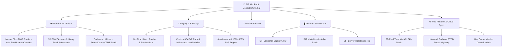

# 🚀 SIR ModPack — The Ultimate Minecraft Experience
### *Next-Generation Cross-Engine Minecraft Ecosystem (Modern 26.2 Fabric • Legacy 1.8.9 Forge • Modular Vanilla+)*

---

## 🌟 Overview

**SIR ModPack** is a complete, master-crafted Minecraft platform engineered for players who demand both **cinematic raytracing fidelity** and **competitive 1000+ FPS PvP responsiveness** without compromises.

Featuring unified cross-engine profiles (**Modern 26.2 Fabric**, **Legacy 1.8.9 Forge**, and **Modular Vanilla+**), **Master Bliss Shaders 2.0** with crystal caustics and 3D POM relief, **TrueType crisp non-pixelated typography**, **1-Click Multi-Core Installer**, and **Universal Zero-Port-Forwarding World Hosting**.

---

## 🏛️ Ecosystem Architecture

---

## ✨ Core Pillars & Features

### 1. 🌌 Modern 26.2 (Fabric Architecture)
* **Master Bliss Shader Suite:**
  * **Crystal Transparent Water:** Dynamic Gerstner waves, refractions, sunlight caustics, and water reflections.
  * **Physics Circular Sun & HD Moon:** Realistic limb darkening, solar corona flare, and accurate lunar phases.
  * **3D Parallax Occlusion Mapping (POM):** Dynamic bump relief across blocks and ores.
  * **Distant Horizons Fix:** Zero depth buffer smearing with massive render distances.
* **Extreme Performance Stack:** Sodium, Lithium, FerriteCore, ImmediatelyFast, Dynamic FPS, and C2ME chunk optimization.
* **Living World:** Fresh Animations CEM mob physics + enhanced swimming and player movement.
* **TrueType Crisp Fonts:** In-game smooth vector font providers eliminating pixelation on 4K/1080p.

### 2. ⚔️ Legacy 1.8.9 (Forge Architecture)
* **Tailored for Hypixel & Competitive PvP:**
  * OptiFine Ultra + Patcher + Essential + InGameAccountSwitcher (IAS).
  * Custom SIR 32x PvP Pack with low fire, short swords, and clean particles.
  * 1000Hz mouse polling rate precision and zero animation delay on sprint/fishing rods.
  * 500 to 1000+ FPS on any modern or laptop hardware.

### 3. 🖥️ SIR Launcher Studio v1.0.0
* **Bespoke Obsidian Cyber-Dark Interface:** Electric cyan accents, responsive DPI-aware centering, and ultra-low latency.
* **Interactive Animated Controls:** Smooth `AnimatedToggleSwitch` widgets, button hover animations, and 2-way toggle menus.
* **Smart Crash Diagnostics & 1-Click Auto-Fix:** Detects OutOfMemory, Incompatible Mods, and Java mismatches with 1-click repair.
* **Real-Time Error Reporting:** Dispatches logs directly to the Owner Dashboard on the web.
* **Complete Bilingual Engine:** 100% full localization in English (LTR) and Arabic (RTL).

### 4. 📦 Multi-Platform SIR Installer v1.0.0
* **4-Step Streamlined Wizard:**
  1. **EULA & Rig Diagnostics:** Automatic RAM and CPU core detection.
  2. **Installation Destination:** Target Portable SIR Launcher, Lunar Client, Vanilla+, or Dual Deployment.
  3. **Personalized Configuration:** Memory allocation slider + Hardware Power Governor (*Smooth Eco Mode* vs *Turbo Speed*).
  4. **Live Multi-Threaded Deployment:** Real-time console log, progress bar, and instant launcher trigger.
* **Integrated Utilities:** Deep Storage & Junk Cleaner + SHA-256 Asset Verifier.

### 5. ⚡ Dedicated Server Host Studio Pro
* **Zero Port-Forwarding:** Encrypted cloud tunneling with permanent public join address.
* **Smart Hardware Tuning:** Personalized RAM and view distance recommendations based on host rig.
* **1-Click Management:** Fabric 26.2 & Purpur/Paper servers, automated world backups, and player studio.

---

## 📥 Downloads & Installation

| Package | Description | Status |
| :--- | :--- | :---: |
| ⚡ **SIR Installer** *(Recommended)* | Smart Auto-Updating installer with Hardware Power Governor and single-file auto-healing CDN. | **Official Release** |
| 📦 **SIR Full Offline Bundle** | Full Standalone pre-extracted distribution with all 240+ mods, Bliss shaders, and 3D POM packs. | **Official Release** |

---

## 🔒 Policies & Legal
* 🛡️ **[Privacy Policy](PRIVACY.md)** — Zero-telemetry, encrypted cloud sync, and data minimization.
* 📄 **[Terms of Service](TERMS.md)** — Open license terms and Mojang Brand Guidelines compliance.
* 🍪 **[Cookie Policy](COOKIES.md)** — Zero tracking cookies and local storage explanation.

---

## 👥 Authors & Community
* **Lead Architect:** **SIR Ahmed** ([Linktree](https://linktr.ee/sir.ahmed))
* **Pair Programming Engine:** DeepMind Antigravity AI
* **Copyright:** © 2026 SIR ModPack Ecosystem. All rights reserved.
